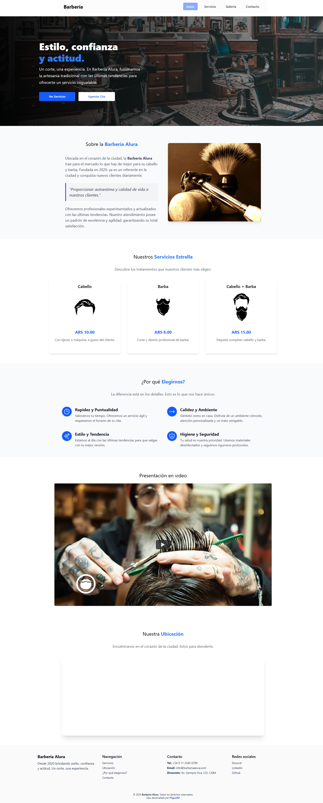

# Barbería - Landing Page en React + Vite


[](https://www.linkedin.com/in/joelmiguelvalente/)
[](https://discord.com/users/465203938900049920)
[](https://github.com/joelmiguelvalente)



Este proyecto es una reimplementación de la landing page original de la barbería, creada con HTML/CSS/JS plano:  
🔗 [Versión original](https://proyectos-random-x.github.io/barberia/)

La nueva versión está construida con tecnologías modernas para una mejor experiencia de desarrollo y accesibilidad:

- ⚛️ **React** con **Vite**
- 💨 **Tailwind CSS** para el diseño responsivo
- 🌐 Accesibilidad mejorada (uso adecuado de etiquetas y roles)
- ✉️ Formulario funcional con integración a [Formspree](https://formspree.io)
- 🧠 Código organizado con alias personalizados
- 🎯 Buenas prácticas en componentes reutilizables

---

## 🧩 Estructura del Proyecto

```bash
src/
├── assets/                # 
├── components/            # Componentes reutilizables (Input, Textarea, etc.)
├── pages/                 # Páginas individuales (Inicio, Servicios, Contacto)
├── App.jsx                # Componente raíz
└── main.jsx               # Punto de entrada
```

---

## 🛠️ Características Implementadas

### ✂️ Landing Page

- Hero principal con presentación del negocio
- Sección de **Servicios** (Cabello, Barba, Tinte, Cejas, Limpieza facial, etc.)
- Sección de **¿Por qué elegirnos?** (Rapidez, Calidez, Atención personalizada, etc.)
- Footer accesible con información de contacto

### 🧾 Servicios

Página con detalle de todos los servicios disponibles, cada uno con:

- Imagen ilustrativa
- Título, descripción y precio
- Etiqueta de "Nuevo" para servicios destacados

### 📞 Contacto

- Formulario accesible y funcional
- Campos:
  - Nombre, correo electrónico, teléfono (input reutilizable)
  - Medio de contacto preferido (radio)
  - Horario de preferencia (select)
  - Mensaje (textarea reutilizable)
- Integración con **Formspree** para envío de datos

---

## 🧠 Alias utilizados

| Alias | Ruta referida       |
|-------|---------------------|
| `@`   | `src/`              |
| `$`   | `src/components/`   |
| `&`   | `src/pages/`        |
| `~`   | `src/assets/`       |

Configurados en `vite.config.js` con `path.resolve`.

---

## 🖼️ Imágenes utilizadas

- 🎨 [dgim-studio](https://www.freepik.es/vector-gratis/plantilla-colorida-maquinilla-afeitar-recta-vintage_8136766.htm) en Freepik
- 🧴 [pikisuperstar](https://www.freepik.es/vector-gratis/pasos-rutina-cuidado-piel-hombres_9469448.htm) en Freepik
- 💇‍♂️ [freepik](https://www.freepik.es/vector-gratis/estilo-pelo-hombre_816107.htm)

---

## 🚀 Instalación

```bash
npm install
npm run dev
```

---

## 📦 Dependencias

- `react`
- `react-dom`
- `react-router-dom`
- `react-lite-youtube-embed`
- `tailwindcss`
- `@tailwindcss/vite`
- `vite`

---

## 💈 Créditos

Creado por [@Miguel92](https://github.com/proyectos-random-x) — versión modernizada de su propio diseño clásico.
